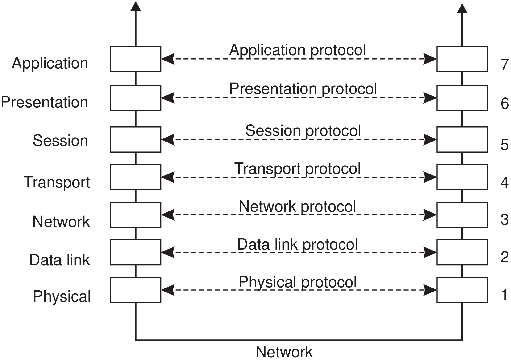

# Intro to network programming using sockets

## Roadmap

- We will talk about the Open Systems Interconnection (OSI) model
- We will review TCP, UDP, IP, ICMP and do some small experiments
- We will use Java to create a server and a client, and we will let them
  communicate using sockets

## OSI model

- Why do we care about this? (think about how you will do communications if you
  have shared memory)
- Can you recall what are the seven levels (layers)?



## `netcat` and `ping`

(Same as "module03b - Networking Basics" on LEARN)

1. SSH into eceubuntu1 and run `nc -l 10000`. (Try adding the last three digits
   of your student number to avoid port conflicts) conflicts)
2. SSH into eceubuntu4 and run `nc eceubuntu1 10000`.
3. On eceubuntu1 enter `Hello` into the terminal, and press ENTER.
4. On eceubuntu4 observe the output, then enter `Hi` into the terminal and press
   ENTER.
5. On eceubuntu1 observe the output.
6. Use `Ctrl-C` to terminate either process.
7. Try again with the server process shut down (i.e., skip step 1).

What do you see by typing `netstat -pnt | grep nc` (Note that `netstat` is
mostly obsolete. Replacement for `netstat` is `ss`.)

```bash
h365chen@eceubuntu4:~$ netstat -pnt|grep nc
tcp        0      0 129.97.92.188:40784     129.97.92.172:10000     ESTABLISHED 342466/nc
```

ICMP (Internet Control Message Protocol) can be used to determine whether a host
is alive, e.g., `ping uwaterloo.ca`. Although one can also decide not to respond
such packages, e.g. Enable stealth mode on macOS.

## POSIX Sockets

They were introduced in the 1970s in Berkeley Unix, and later adopted as a POSIX
standard (with only very few adaptations).

| Operation | Description                                                                            |
|-----------|----------------------------------------------------------------------------------------|
| socket    | Create a new communication end point                                                   |
| bind      | Attach a local address to a socket                                                     |
| listen    | Tell operating system what the maximum number of pending connection requests should be |
| accept    | Block caller until a connection request arrives                                        |
| connect   | Actively attempt to establish a connection                                             |
| send      | Send some data over the connection                                                     |
| receive   | Receive some data over the connection                                                  |
| close     | Release the connection                                                                 |

### Live coding in Java

(full code in "module03b - Java client and server.tar" on LEARN, I put it under
week2/ as well)

(Slides made by Ahmed are also available on LEARN)

On one machine

```bash
javac Server.java
java Server 10000
```

On another machine

```bash
javac Client.java
java Client localhost 10000 "This is the data to send"
```

### Questions

- How many sockets are created by the client? How many by the server?
- At what points in the code do the sockets bind, listen, accept, connect, read,
  write, and close?
- How are request and response messages delimited?
- Is the server able to process requests from multiple clients concurrently?
- Why is there no need to call writer.flush()?
- How portable is the code?

### Other socket options you may want to explore

- **setReuseAddress**: controls `SO_REUSEADDR` option, which deals with the
  problem of binding a local address for which there is a prior TCP connection
  in the `TIME_WAIT` state (e.g., because a server process crashed unexpectedly
  and was restarted). (e.g., `sock.setReuseAddress()`)
- **setSoTimeout**: determines the timeout period for a blocking read on the
  socket's InputStream.
- **setKeepAlive**: controls TCP "keep alive" packets
- **setTcpNoDelay**: controls `TCP_NODELAY` option, used to disable [Nagle's
algorithm](https://en.wikipedia.org/wiki/Nagle%27s_algorithm) when required to
improve latency.
- **setSendBufferSize/setReceiveBufferSize**: controls the `SO_SNDBUF` and
  `SO_RCVBUF` options, which are *hints* for determining the size of the
  underlying network I/O buffers.

## References

M. van Steen and A.S. Tanenbaum, Distributed Systems, 3rd ed.,
distributed-systems.net, 2017.
