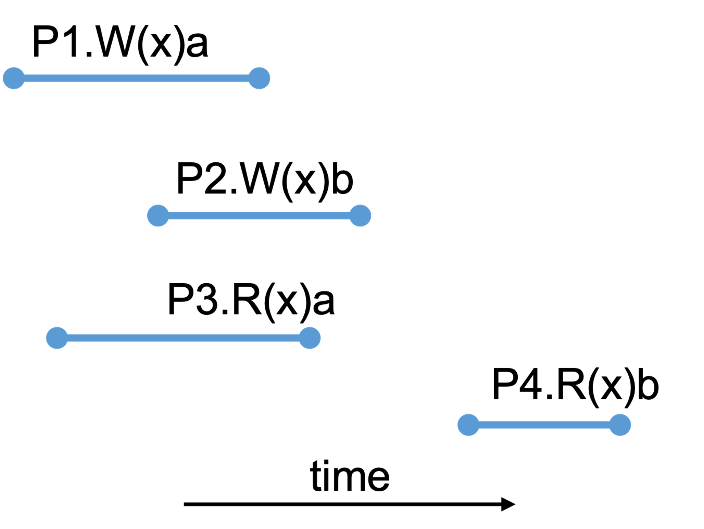

layout: true

class: middle

---

class: center, middle, inverse

# Consistency and Replication

## Detailed examples

---

## Roadmap

- We will go through examples in *module09a - Consistency and Replication -
  detailed examples*
- Then I will show you some additional examples

---

## Review

### Sequential consistency

A data store is sequentially consistent when:

The result of any execution is the same as if the (read and write) operations by
all processes on the data store were executed in some sequential order and the
operations of each individual process appear in this sequence in the order
specified by its program.

---

### Causal consistency

A data store is causally consistent when:

Writes related by the "causally precedes" relation must be seen by all processes
in the same order. Concurrent writes (i.e., ones that are not related by
“causally precedes”) may be seen in a different order by different processes.

"Causally precedes" is the transitive closure of two rules:
1. Op1 causally precedes Op2 if Op1 occurs before Op2 in the same process.
2. Op1 causally precedes Op2 if Op2 reads a value written by Op1.

---

### Linearizability

A data store is linearizable when:

The result of any execution is the same as if the operations by all processes on
the data store were executed in some sequential order that extends the "happens
before" relation. In other words, if operation Op1 finishes before operation Op2
begins, then Op1 must precede Op2 in the sequential order.

---

## Examples in the slides

---

---

---

---

---

## Additional Examples

(I will post answers sometime afterwards)

Question: sequential consistent or causal consistent?

---

<!-- --- -->

<!--  -->

---

## Think

Among sequential consistency, causal consistency, and linearizability, which
property is the strongest and which is the weakest?

(Property A is stronger than property B if every execution that satisfies A also
satisfies B, and there is some execution that satisfies B but not A.)
